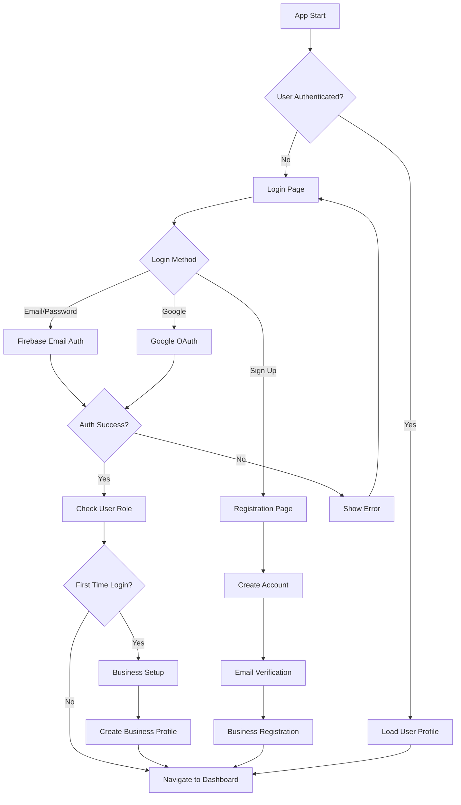
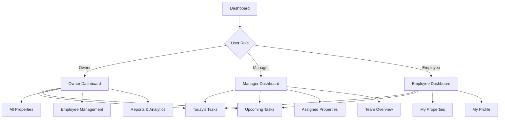
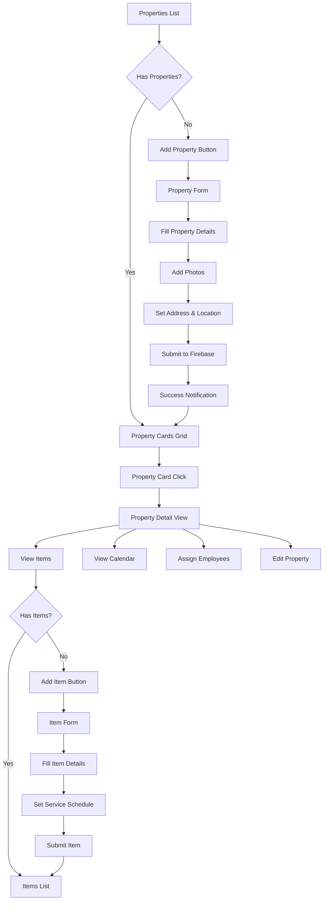
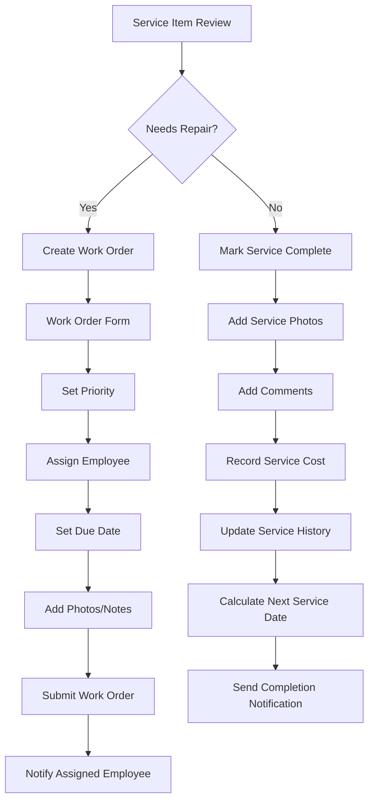
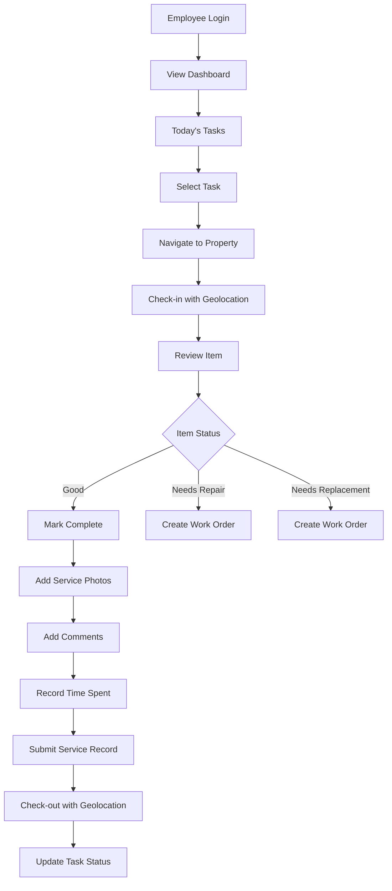

# IoPropertyManager - Application Architecture & Flow

## Application Flow Diagrams

### 1. User Authentication Flow


### 2. Dashboard Navigation Flow


### 3. Property Management Flow


### 4. Work Order Management Flow


### 5. Employee Task Flow


## Component Architecture

### 1. Core Modules Structure
```
src/app/
├── core/
│   ├── guards/
│   │   ├── auth.guard.ts
│   │   ├── role.guard.ts
│   │   └── business.guard.ts
│   ├── services/
│   │   ├── auth.service.ts
│   │   ├── firebase.service.ts
│   │   ├── geolocation.service.ts
│   │   ├── camera.service.ts
│   │   ├── notification.service.ts
│   │   └── storage.service.ts
│   ├── models/ (existing)
│   └── interceptors/
│       ├── auth.interceptor.ts
│       └── error.interceptor.ts
├── shared/
│   ├── components/
│   │   ├── loading/
│   │   ├── image-viewer/
│   │   ├── confirmation-modal/
│   │   ├── date-picker/
│   │   ├── address-picker/
│   │   └── employee-selector/
│   ├── pipes/
│   │   ├── currency.pipe.ts
│   │   ├── time-ago.pipe.ts
│   │   └── role-display.pipe.ts
│   └── directives/
├── features/
│   ├── auth/
│   │   ├── login/
│   │   ├── register/
│   │   └── business-setup/
│   ├── dashboard/
│   │   ├── owner-dashboard/
│   │   ├── manager-dashboard/
│   │   └── employee-dashboard/
│   ├── properties/
│   │   ├── property-list/
│   │   ├── property-detail/
│   │   ├── property-form/
│   │   └── property-map/
│   ├── items/
│   │   ├── item-list/
│   │   ├── item-detail/
│   │   ├── item-form/
│   │   └── service-history/
│   ├── work-orders/
│   │   ├── work-order-list/
│   │   ├── work-order-detail/
│   │   └── work-order-form/
│   ├── employees/
│   │   ├── employee-list/
│   │   ├── employee-detail/
│   │   └── employee-form/
│   ├── calendar/
│   │   └── calendar-view/
│   ├── messages/
│   │   ├── message-list/
│   │   └── message-detail/
│   ├── reports/
│   │   ├── overview/
│   │   ├── cost-analysis/
│   │   └── invoice-generator/
│   └── settings/
│       ├── user-profile/
│       ├── business-settings/
│       └── app-settings/
└── layout/
    ├── tabs/
    ├── menu/
    └── header/
```

### 2. State Management Strategy
- **Local State**: Component-level reactive forms and UI state
- **Service State**: Business logic and API communication via services
- **Firebase Real-time**: Real-time updates for collaborative features
- **Local Storage**: User preferences and offline capability

### 3. Routing Structure
```typescript
const routes: Routes = [
  { path: '', redirectTo: '/dashboard', pathMatch: 'full' },
  { path: 'auth', loadChildren: () => import('./features/auth/auth.routes') },
  { 
    path: 'dashboard', 
    loadChildren: () => import('./features/dashboard/dashboard.routes'),
    canActivate: [AuthGuard]
  },
  { 
    path: 'properties', 
    loadChildren: () => import('./features/properties/properties.routes'),
    canActivate: [AuthGuard]
  },
  // ... other feature routes
];
```

## Data Flow Architecture

### 1. Service Layer Pattern
```typescript
// Example: PropertyService
@Injectable({
  providedIn: 'root'
})
export class PropertyService {
  private propertiesCollection = this.firestore.collection<Property>('properties');
  
  // Real-time properties stream
  getProperties(businessId: string): Observable<Property[]> {
    return this.propertiesCollection
      .where('businessId', '==', businessId)
      .where('isActive', '==', true)
      .orderBy('createdAt', 'desc')
      .valueChanges({ idField: 'id' });
  }
  
  // CRUD operations with optimistic updates
  async createProperty(property: CreatePropertyData): Promise<string> {
    const id = this.firestore.createId();
    await this.propertiesCollection.doc(id).set({
      ...property,
      id,
      createdAt: serverTimestamp(),
      updatedAt: serverTimestamp()
    });
    return id;
  }
}
```

### 2. Real-time Updates Pattern
```typescript
// Component subscribes to real-time data
export class PropertyListComponent {
  properties$ = this.propertyService.getProperties(this.businessId);
  
  constructor(private propertyService: PropertyService) {}
}
```

### 3. Offline-First Strategy
- Cache critical data locally
- Queue mutations for when online
- Sync when connection restored
- Show offline indicators